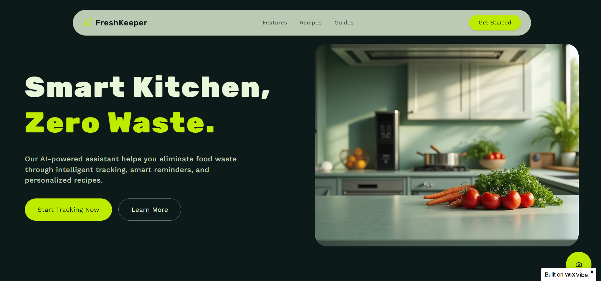
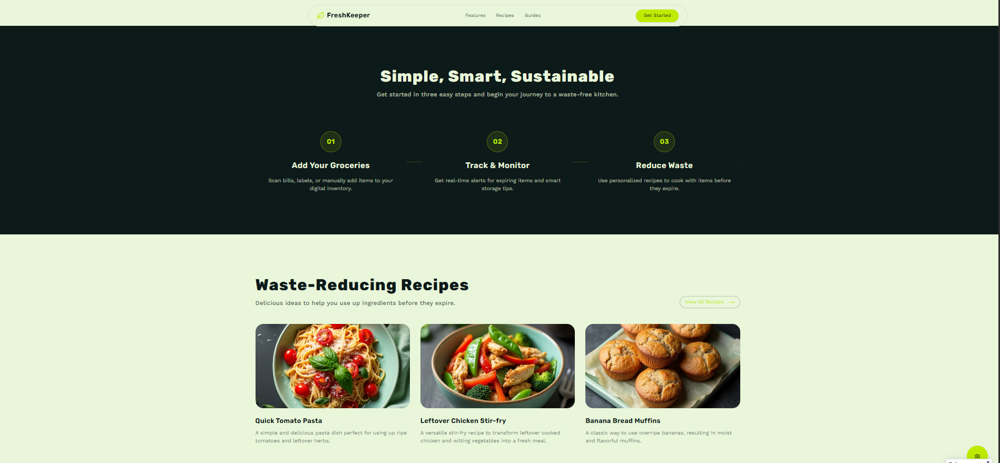

🌿 FreshKeeper (AI)

An AI-powered kitchen assistant that helps households reduce food wastage through intelligent tracking, expiry reminders, and recipe suggestions.

👨‍🎓 Student Information

Name: Sariki Madhavi
Branch: CSE
Batch Duration: 24-11-2025 to 28-11-2025

🚀 Project Overview

FreshKeeper is an AI-based system designed to help families manage groceries efficiently and reduce daily food waste. It tracks stored items, monitors expiry dates, sends timely alerts, and provides smart recipe suggestions based on ingredients nearing expiry.
The system promotes sustainable habits and helps households save money while reducing waste.

🌐 Live Website

🔗 https://my-site-itrpkrv8-madhavimadhu00000.wix-vibe.com

📄 Project Report

📥 Download: [Madhavi.pdf](Madhavi.pdf)

## 📸 Screenshots

### 🏠 Homepage

### ⚠️ Challenge Section

### 🧠 Features Section

### 🚀 Benefits Section

